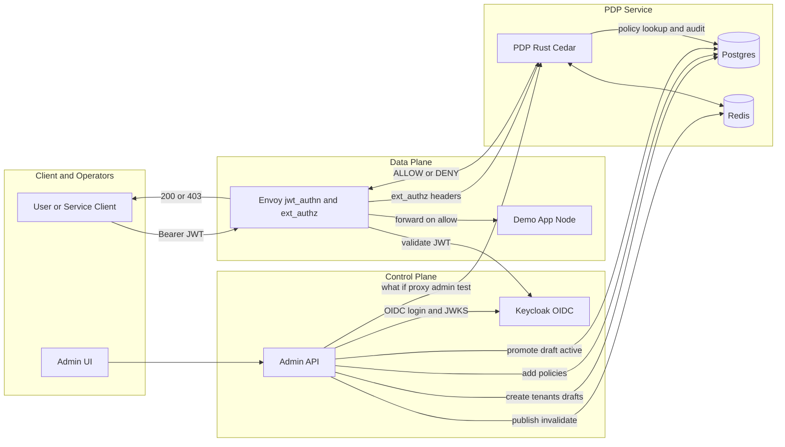

# 🛡️ ABAC Platform (Monorepo)

 

Policy-driven authorization using **Cedar** with:
- **Envoy** (ext_authz) in front of a demo app
- **PDP (Rust+cedar)** + **Postgres** (policies, attrs, audit) + **Redis** (cache + pub/sub)
- **Admin API (NestJS/Fastify)** to manage tenants, policies, entities
- **Admin UI (Next.js)** _(coming soon)_

## 🚀 Quickstart
```bash
cd infra
docker compose up --build -d
# Health
curl -s localhost:8081/ready         # PDP
curl -i localhost:8080/public/health # App with Envoy
curl -i localhost:3001/health        # Admin-API 
````

## 🏗️ Architecture

```
Client → Envoy (jwt_authn → ext_authz) → PDP (Cedar)
                                 ├─ Postgres (policies/attrs/audit)
                                 ├─ Redis (cache & invalidation)
                                 └─ Admin API (policy mgmt)
```



## 📦 Packages

* [`pdp/`](pdp/) — Rust PDP service (Cedar, DB, Redis, metrics)
* [`admin-api/`](admin-api/) — NestJS admin API (OIDC/Keycloak, CRUD for tenants/policies/entities)
* `admin-ui/` — *(planned)* Next.js UI

## 🔐 Auth modes

* **Dev**: HS256 JWT (Envoy) — used by the example gateway
* **Admin API**: OIDC (Keycloak) with realm roles (`admin`, `ops`)

> See each package README for environment variables and curl examples.

## 🗺️ Repo layout

```
.
├─ admin-api/      # NestJS admin API
├─ pdp/            # Rust PDP (Cedar)
├─ examples/app/   # demo app
├─ infra/          # compose + envoy + migrations
└─ README.md       
```

## 📄 License

MIT