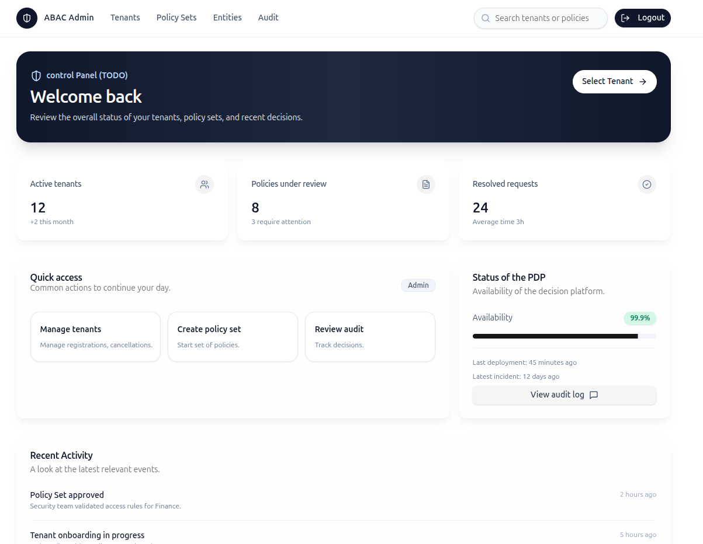

# 🛡️ ABAC Platform

 

<p align="center">
  
  &nbsp;&nbsp;
  
</p>

## 🧩 At a Glance / Core Components

Policy-driven authorization using **Cedar** with four primary components:

- **Gateway**: **Envoy** (`ext_authz`) in front of a demo app.
- **Authorization Service**: A **Rust-based PDP** using **Cedar**, with **Postgres** for storage and **Redis** for caching.
- **Admin API**: A **NestJS (Fastify)** backend to manage tenants, policies, and entities.
- **Admin UI**: An **Astro + React** frontend for policy and tenant management.

## 🧱 Tech Stack

* **Frontend**: Astro + React with TypeScript and Tailwind CSS.
* **Backend**: NestJS (Fastify) for the admin API.
* **Authorization Service**: Rust with the Cedar policy engine.
* **Infrastructure**: Envoy (Proxy), Postgres (DB), Redis (Cache).
* **Identity**: Keycloak (OIDC).

## 🚀 Quickstart
```bash
cd infra
docker compose up --build -d
# Health
curl -s localhost:8081/ready         # PDP
curl -i localhost:8080/public/health # App with Envoy
curl -i localhost:3001/health        # Admin-API 
````

## 🏗️ Architecture

```
Client → Envoy (jwt_authn → ext_authz) → PDP (Cedar)
                                 ├─ Postgres (policies/attrs/audit)
                                 ├─ Redis (cache & invalidation)
                                 └─ Admin API (policy mgmt)
```


## 📦 Packages

* [`pdp/`](pdp/) — Rust PDP service (Cedar, DB, Redis, metrics)
* [`admin-api/`](admin-api/) — NestJS admin API (OIDC/Keycloak, CRUD for tenants/policies/entities)
* [`admin-ui/`](admin-ui/) — Astro + React for policy and tenant management

## 🔐 Auth modes

* **Dev**: HS256 JWT (Envoy) — used by the example gateway
* **Admin API**: OIDC (Keycloak) with realm roles (`admin`, `ops`)

> See each package README for environment variables and curl examples.

## 🗺️ Repo layout

```
.
├─ admin-api/      # NestJS admin API
├─ admin-ui/       # Astro + React admin ui
├─ pdp/            # Rust PDP (Cedar)
├─ examples/app/   # demo app
├─ infra/          # compose + envoy + migrations
└─ README.md       
```

## 📄 License

Copyright (c) 2025 Jefferson Leon.

This project is licensed under the [MIT License](./LICENSE).