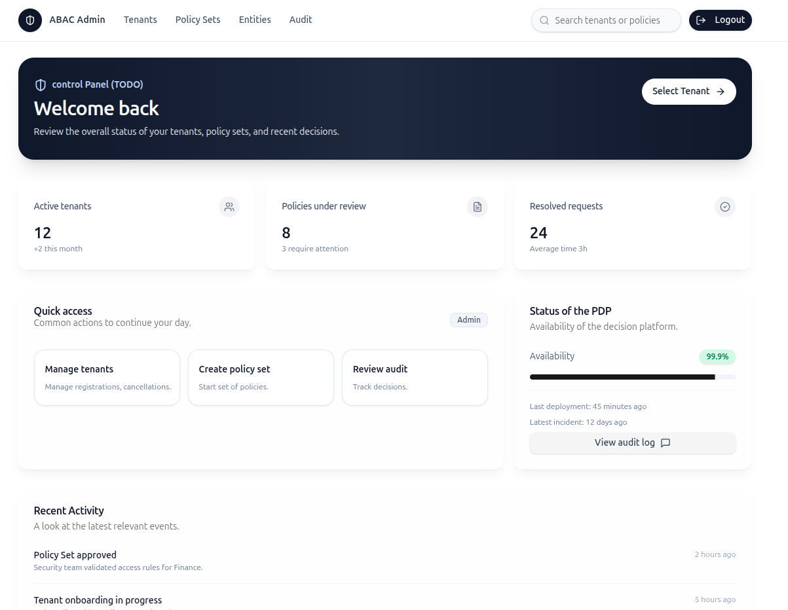
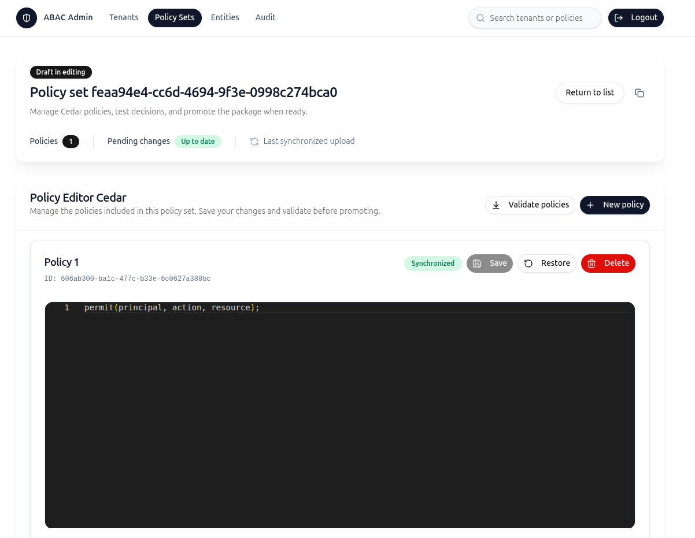

# 🛡️ ABAC Admin UI

<p align="center">
  
  &nbsp;&nbsp;
  
</p>

## 🚀 Overview
An Astro + React dashboard for managing Cedar policy assets across tenants. The interface centralizes tenant provisioning, draft policy authoring, Cedar validation, entity management, audit trails, and health insights for the PDP service.

## ✨ Key Capabilities
- 🔐 **OIDC login via Keycloak** with PKCE, persistent session handling, and token refresh.
- 🏷️ **Tenant management** to browse, create, and administer isolated workspaces.
- 🧩 **Policy set lifecycle** with draft/active states, Monaco-based Cedar editing, validation, what-if testing, and promotion.
- 🧾 **Entity & attribute CRUD** for principals/resources with JSON attribute editing and Cedar UID helpers.
- 📊 **Audit explorer** showing tenant-scoped activity with filters by status and date range.
- 📈 **Dashboard overview** with at-a-glance stats, quick actions, PDP availability, and hard-coded sample insights (to be wired later).

## 🧱 Tech Stack
- Astro + React + TypeScript for the UI layer.
- Tailwind CSS + shadcn/ui for styling and accessible components.
- Monaco Editor for Cedar authoring, validation, and diagnostics.
- Keycloak for identity; Admin API (NestJS) for policy orchestration.

## 📦 Project Layout
```
src/
 ├─ components/        // Reusable React widgets (tables, forms, Cedar editor, etc.)
 ├─ pages/             // Astro routes (login, tenants, policy sets, dashboard)
 ├─ lib/               // API clients, auth helpers, Cedar utilities
 └─ styles/            // Tailwind layers and design tokens
public/                // Static assets, Keycloak config overrides
```

## 🛠️ Getting Started

*First ensure your backend stack is UP (in /infra: docker compose up --build -d)*
1. Install dependencies (Node 20.x recommended):
   ```bash
   npm install
   ```
2. Duplicate `.env.example` as `.env` and configure:
   - `KEYCLOAK_ISSUER` → Keycloak realm issuer URL
   - `KEYCLOAK_CLIENT_ID` → public client configured for PKCE
   - `ADMIN_API_BASE_URL` → Admin API gateway URL
   - `ADMIN_API_AUDIENCE` → Audience expected by the NestJS API
3. Launch the development server:
   ```bash
   npm run dev
   ```
   Visit `http://localhost:4321` to verify the UI and login flow.

4. Log in using the default credentials. These users are pre-configured in the Keycloak realm (`keycloak/realm-export/abac-realm.json`).
   | Role  | Username      | Password   |
   |-------|---------------|------------|
   | Admin | `alice-admin` | `password` |
   | Ops   | `oscar-ops`   | `password` |

## 🔁 Auth & API Flow
- On login, the app redirects to Keycloak using PKCE. Tokens persist via session storage.
- The Admin API client attaches the user JWT to every request.
- Cedar validation calls `POST /admin/validate`; what-if tests call `POST /admin/test` for the selected policy set state.
- Draft promotion triggers the Admin API endpoint responsible for swapping draft → active.

## 🧪 Testing & Quality
- Unit/component tests (when added) run with `npm test`.
- Lint with `npm run lint`; format via `npm run format` if configured.
- Recommended: add integration tests for policy validations and what-if simulations once backend endpoints stabilize.

## 🖼️ PAGES IMAGES
- [`dashboard`](images/dashboard.png)
- [`tenants`](images/tenants.png)
- [`policyset`](images/policyset.png)
- [`promotion`](images/promotion.png)
- [`audit`](images/audit.png)
- [`entities`](images/entities.png)

## 🗺️ Roadmap Notes
- Replace hard-coded dashboard metrics once real telemetry endpoints are ready.
- Integrate live PDP health checks and incident banners.
- Improve policy edit page.

## 📚 Useful References
- Cedar Language Guide – https://docs.cedarpolicy.com/
- Keycloak Docs – https://www.keycloak.org/documentation